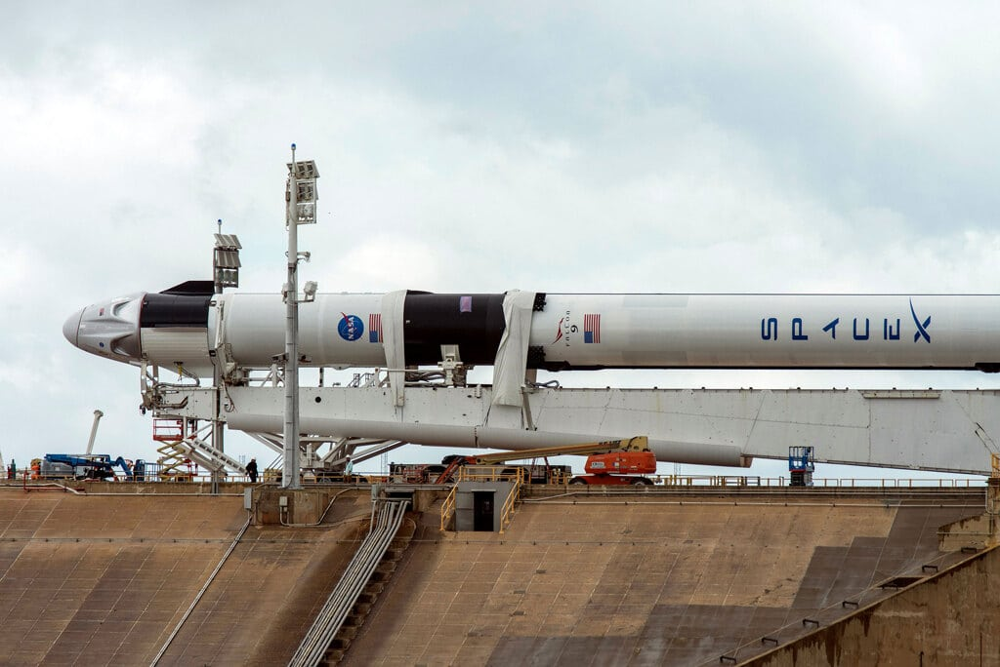

```{r setup, include=FALSE}
knitr::opts_chunk$set(echo = FALSE)
```

## Domande Poste

* Quali sono i paesi che eseguono questi lanci ?

\

* Qual'è il numero di fallimenti/successi di questi lanci missilistici ?



## Motivazioni 

1. Mi sono posto questa domanda per avere una visualizzazione visiva su un mappamondo di quest'ultimi paesi 

2. Mi sono posto questa domanda per sapere se effettivamente i lanci missilistici sono fruttevoli oppure se sono solamente una spreco di risorse 

## Descrizione del dataset
Per questo progetto il dataset che ho usato è il seguente (mission_launches.csv) scaricato gratuitamente dal sito web di kaggle, tratta i lanci missilistici avvenuti dal 1965 al 2020 


## Analisi effettuate

## Conclusioni
dhdfhdfhad